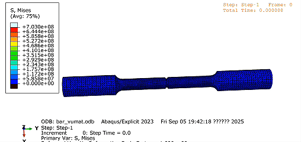
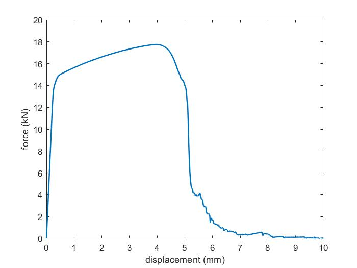

# GTN_Model_VUAMT

This project implements the GTN (Gurson-Tvergaard-Needleman) damage model using an **Abaqus VUMAT** user material subroutine.

The numerical implementation is based on the original GTN model and is adapted from the project:

- https://github.com/irfancn/Abaqus-VUMAT-Gurson_GTN.git

## Documentation

The algorithmic details and model derivation are documented in the accompanying Word file.

## Tension Test Results

- Stress evolution animation during tension: `tension.gif`
- Force-displacement curve: `disforce.png`

